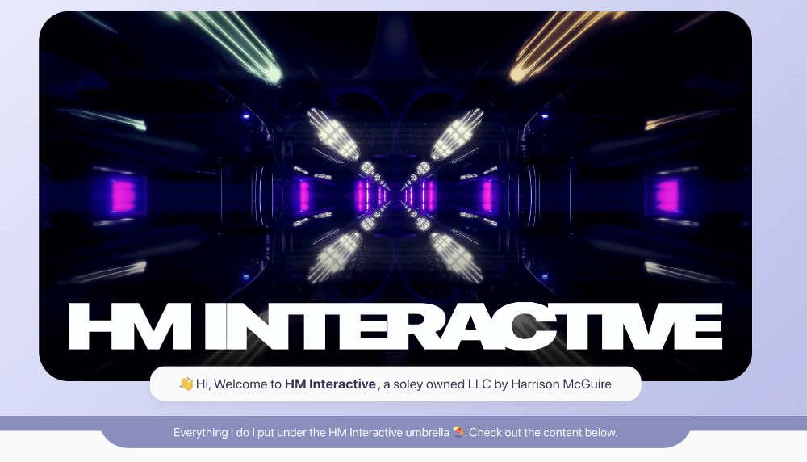

# HM Interactive
<!--  -->


# Live Site
[hmactive.com](https://hmactive.com/)

## Developing

```bash
npm i
npm run dev

# or start the server and open the app in a new browser tab
npm run dev -- --open

# run with network
npm run dev -- --host
```
